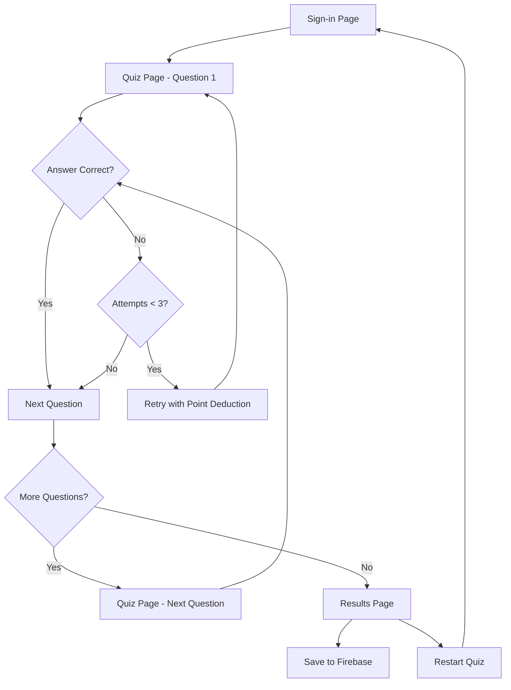

# Quiz Website Enhancement - Product Requirements Document

## 1. Product Overview
A professional quiz website enhancement that improves user experience through modern UI design and adds Firebase integration for result storage. The project builds upon an existing React TypeScript quiz application to create a polished, data-driven assessment platform.

The enhancement focuses on visual improvements and backend integration while preserving the core quiz functionality that already works well.

## 2. Core Features

### 2.1 User Roles
| Role | Registration Method | Core Permissions |
|------|---------------------|------------------|
| Quiz Taker | Name and age input | Can take quiz, view results, restart quiz |

### 2.2 Feature Module
Our quiz enhancement consists of the following main pages:
1. **Sign-in Page**: user information collection, quiz introduction, start button.
2. **Quiz Page**: question display, answer selection, progress tracking, attempt management.
3. **Results Page**: score display, completion message, restart option, data storage confirmation.

### 2.3 Page Details
| Page Name | Module Name | Feature description |
|-----------|-------------|---------------------|
| Sign-in Page | User Input Form | Collect user name and age with validation. Display welcome message and quiz instructions. Styled start button to begin quiz. |
| Sign-in Page | Header Navigation | Professional header with logo, contact info, and navigation menu (preserved from current design). |
| Quiz Page | Question Display | Present questions in clean, readable format with proper typography. Support for current text format and future image format. |
| Quiz Page | Answer Selection | Display multiple choice options as styled buttons or cards. Clear visual feedback for selection and submission. |
| Quiz Page | Progress Tracking | Show current question number, attempts remaining, and points available. Visual progress indicator. |
| Quiz Page | Attempt Management | Handle incorrect answers with visual feedback. Manage 3-attempt limit per question with point deduction. |
| Results Page | Score Summary | Display final score, correct answers, and performance metrics in attractive format. |
| Results Page | Data Storage | Save quiz results to Firebase including user info, answers, score, and timestamp. |
| Results Page | Quiz Actions | Restart quiz button and option to view detailed results. |

## 3. Core Process
**Quiz Taking Flow:**
1. User enters name and age on sign-in page
2. User clicks "Start Quiz" to begin assessment
3. For each question: user selects answer, submits, receives feedback
4. If incorrect: user gets up to 2 more attempts with point deduction
5. After 3 attempts or correct answer: automatically advance to next question
6. Upon completion: display results and save data to Firebase
7. User can restart quiz or exit

## 4. User Interface Design
### 4.1 Design Style
- **Primary Colors**: Blue (#3B82F6) for primary actions, Gray (#6B7280) for secondary elements
- **Secondary Colors**: Green (#10B981) for success states, Red (#EF4444) for errors
- **Button Style**: Rounded corners (8px), subtle shadows, hover effects with color transitions
- **Font**: System fonts (system-ui, Avenir, Helvetica) with clear hierarchy - headings (24-32px), body text (16px), small text (14px)
- **Layout Style**: Card-based design with clean spacing, centered content, responsive grid layout
- **Icons**: Simple, consistent icons for navigation and feedback states

### 4.2 Page Design Overview
| Page Name | Module Name | UI Elements |
|-----------|-------------|-------------|
| Sign-in Page | User Input Form | Centered card with input fields, labels, validation messages. Blue gradient background. Clean typography with 16px body text. |
| Sign-in Page | Header Navigation | Preserved existing header with logo, contact info, navigation links. Professional styling maintained. |
| Quiz Page | Question Display | Large, readable question text (20px), clean card container with subtle shadow, proper spacing and padding. |
| Quiz Page | Answer Selection | Grid of answer choice buttons, hover effects, selected state highlighting, clear visual hierarchy. |
| Quiz Page | Progress Tracking | Progress bar, question counter, attempts indicator with color coding (green/yellow/red). |
| Results Page | Score Summary | Large score display, breakdown cards, congratulatory messaging, clean data presentation. |

### 4.3 Responsiveness
Desktop-first design with mobile-adaptive layout. Touch-friendly button sizes (minimum 44px) for mobile devices. Responsive grid that stacks on smaller screens. Optimized for both desktop quiz-taking and mobile accessibility.