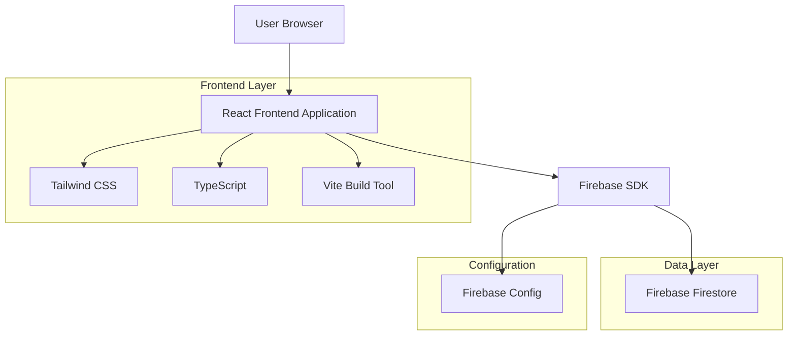
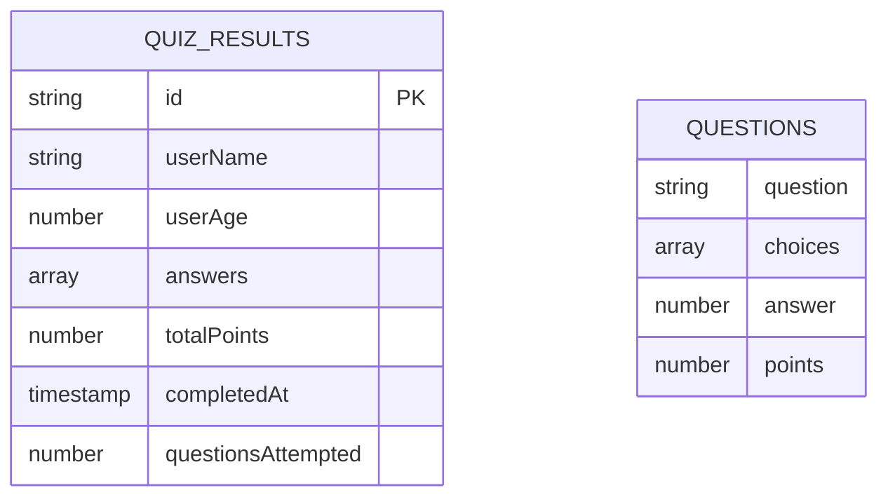

# Quiz Website Enhancement - Technical Architecture Document

## 1. Architecture Design



## 2. Technology Description
- Frontend: React@19 + TypeScript@5.8 + Tailwind CSS@4.1 + Vite@7.1
- Backend: Firebase Firestore (NoSQL database)
- Build Tool: Vite with React SWC plugin
- Styling: Tailwind CSS with custom components

## 3. Route Definitions
| Route | Purpose |
|-------|---------|
| / | Main quiz application with three states: sign-in, testing, and results |

Note: This is a single-page application (SPA) that manages state transitions internally rather than using traditional routing.

## 4. API Definitions

### 4.1 Firebase Integration

Quiz Result Storage
```typescript
// Firebase Firestore Collection: quiz_results
interface QuizResult {
  id: string;
  userName: string;
  userAge: number;
  answers: number[][];
  totalPoints: number;
  completedAt: Timestamp;
  questionsAttempted: number;
}
```

Firebase Configuration
```typescript
interface FirebaseConfig {
  apiKey: string;
  authDomain: string;
  projectId: string;
  storageBucket: string;
  messagingSenderId: string;
  appId: string;
}
```

### 4.2 Core Types

Question Structure
```typescript
interface Question {
  question: string;
  choices: number[];
  answer: number;
  points: number;
}
```

Game State Management
```typescript
type GameState = "sign-in" | "currently-testing" | "finished";
```

## 5. Data Model

### 5.1 Data Model Definition


### 5.2 Data Definition Language

Firebase Firestore Collection Structure
```javascript
// Collection: quiz_results
// Document structure:
{
  id: "auto-generated-id",
  userName: "John Doe",
  userAge: 25,
  answers: [[0, 1], [1, 2], [2, 3]], // [questionIndex, userAnswer]
  totalPoints: 7,
  completedAt: firebase.firestore.Timestamp.now(),
  questionsAttempted: 3
}

// Firestore Security Rules
rules_version = '2';
service cloud.firestore {
  match /databases/{database}/documents {
    match /quiz_results/{document} {
      allow read, write: if true; // Public access for quiz results
    }
  }
}
```

Firebase Configuration Setup
```javascript
// firebase.config.js
import { initializeApp } from 'firebase/app';
import { getFirestore } from 'firebase/firestore';

const firebaseConfig = {
  apiKey: "your-api-key",
  authDomain: "your-project.firebaseapp.com",
  projectId: "your-project-id",
  storageBucket: "your-project.appspot.com",
  messagingSenderId: "123456789",
  appId: "your-app-id"
};

const app = initializeApp(firebaseConfig);
export const db = getFirestore(app);
```

Required Dependencies
```json
{
  "dependencies": {
    "firebase": "^10.7.1"
  }
}
```

## 6. Implementation Guidelines

### 6.1 Styling Enhancements
- Use Tailwind CSS utility classes for consistent spacing and colors
- Create reusable component classes for buttons, cards, and form elements
- Implement responsive design with mobile-first approach
- Add hover and focus states for interactive elements

### 6.2 Firebase Integration
- Initialize Firebase in a separate config file
- Create utility functions for saving quiz results
- Handle Firebase errors gracefully with user feedback
- Ensure data validation before saving to Firestore

### 6.3 Code Organization
- Maintain existing component structure in App.tsx
- Add Firebase utilities in separate service file
- Keep question data structure unchanged for future image support
- Preserve existing state management and quiz logic